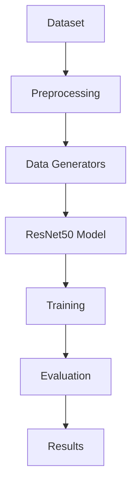

# Pneumonia Detection from Chest X-ray Images using Deep Learning

## Overview
Deep learning-based system for classifying chest X-ray images into Pneumonia and Normal using transfer learning (ResNet50). The pipeline includes preprocessing, training, and evaluation.

---

## Dataset
Chest X-Ray Images (Pneumonia) – Kaggle  
Classes: NORMAL, PNEUMONIA  

```text
Structure:

data/
└── chest_xray/
    ├── train/
    │   ├── NORMAL/
    │   └── PNEUMONIA/
    ├── val/
    │   ├── NORMAL/
    │   └── PNEUMONIA/
    └── test/
        ├── NORMAL/
        └── PNEUMONIA/
```
---

## Tech Stack
Python, TensorFlow/Keras, NumPy, Pandas, Matplotlib, OpenCV, Scikit-learn

---

## Project Structure
```text
pneumonia-detection-cnn/
├── data/
├── src/
│   ├── data_loader.py
│   ├── model.py
│   ├── train.py
│   ├── evaluate.py
├── models/
│   └── best_model.h5
├── outputs/
│   └── accuracy.png
├── requirements.txt
└── README.md
```
---

## Method

Preprocessing:
- Resize: 224×224  
- Normalize: 1/255  
- Augmentation: rotation, zoom, flip  

Model:
- ResNet50 (ImageNet pretrained)  
- Frozen base layers  
- Dense classifier (sigmoid output)  

Training:
- Loss: Binary Crossentropy  
- Optimizer: Adam  
- Early stopping + checkpointing  

---

## Workflow



---

## Results
- Accuracy: ~76%  
- High recall for pneumonia (~90%)  
- Model prioritizes pneumonia detection (reduces missed cases)


---

## Summary
- Transfer learning improves performance on limited medical datasets  
- Data augmentation enhances generalization  
- Model is suitable for pneumonia screening tasks  


